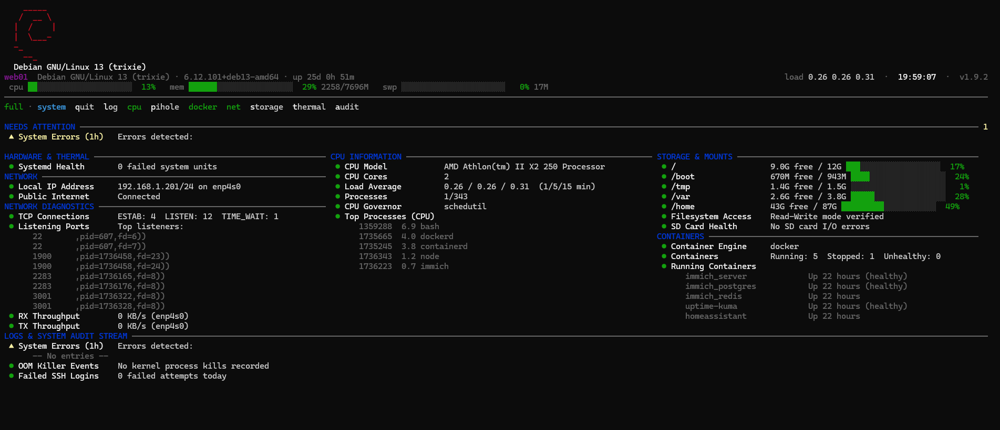
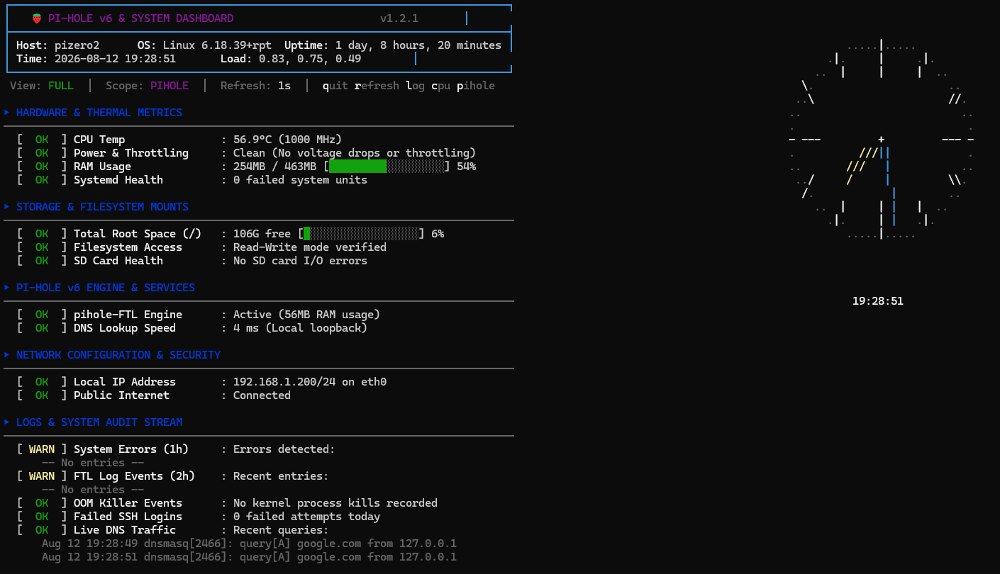

# healthcheck

Interactive top-style terminal dashboard for monitoring any Linux system. Supports **Pi-hole v6** monitoring out of the box, but works as a general-purpose system health tool on any distro.


## Screenshots

### System Mode


### Pi-hole Mode


## Features

- **Two-column boxed layout** — every section is its own bordered panel; on terminals ≥128 columns panels tile into two columns to use the full screen, collapsing to a single column on narrower terminals
- **Fully adaptive layout** — header box, panels, and progress bars all resize to the terminal; nothing wraps or misaligns at any width
- **Runs on any Linux distro** — auto-detects OS and displays a colored ASCII logo
- **Regular & Pi-hole modes** — system-only monitoring or full Pi-hole dashboard, auto-detected and toggleable at runtime
- **Flicker-free refresh** — redraws in-place like `top`/`btop`, no screen clearing (default: 1s)
- **Live CPU utilisation** — true CPU%, computed from `/proc/stat` jiffy deltas between frames
- **Memory & swap gauges** — colored bars with used/total figures
- **Active-panel hotkey legend** — enabled panels light up green in the key hints
- **ASCII analog clock** — lines-only clock rendered as a panel at the top of the right column
- **Keyboard controls** — toggle views, modes, and panels without restarting
- **Hardware monitoring** — CPU temperature, clock speed, throttling state, RAM usage
- **CPU info panel** — model, cores, load average, governor, frequency range, top processes
- **Network diagnostics** — active connections, listening ports, DNS latency matrix, live RX/TX throughput
- **Docker & container health** — auto-detects Docker/Podman, shows running/stopped/unhealthy counts, top containers by CPU/memory, restart loop detection
- **Storage performance** — I/O wait times, live disk throughput, S.M.A.R.T. drive health, RAID/ZFS/Btrfs array status
- **Thermal & sensor expansion** — drive temperatures, fan speeds, battery/UPS monitoring
- **Security audit** — firewall status (ufw/nftables/iptables), Fail2ban jails, pending updates, active SSH sessions, kernel restart checks
- **Pi-hole v6 engine** — FTL service status, memory footprint, DNS lookup latency
- **Log auditing** — system errors, OOM kills, failed SSH logins, FTL events, live DNS traffic
- **JSON output** — structured JSON payload for Home Assistant, Prometheus, or custom tooling
- **Webhook alerts** — Discord, Slack, or generic webhook notifications when thresholds are breached
- **Snapshot logging** — append JSON snapshots to a log file on each refresh cycle
- **Custom thresholds** — configurable CPU temp, RAM, and disk warning levels via CLI flags
- **No-color mode** — disable ANSI codes for piping to files or plain terminals
- **Self-updating** — checks GitHub for new versions and installs with `-u`
- **Portable** — no hardcoded IPs or hostnames; optional checks skip gracefully if tools are missing

## Supported Distros

Auto-detected via `/etc/os-release` with colored ASCII logos for:

Raspberry Pi OS, Debian, Ubuntu, Linux Mint, Pop!_OS, Arch, Manjaro, EndeavourOS, Fedora, CentOS, RHEL, Rocky, Alma, Alpine, Kali, Gentoo, Void, openSUSE/SLES — with a Tux penguin fallback for unrecognized distros.

## Quick Start

```bash
# Copy to your machine
scp healthcheck.sh user@<ip>:~/

# Make executable and run
chmod +x healthcheck.sh
./healthcheck.sh
```

## Install System-Wide

```bash
sudo cp healthcheck.sh /usr/local/bin/healthcheck
sudo chmod +x /usr/local/bin/healthcheck
```

After installing, run `healthcheck -u` anytime to update to the latest version from GitHub.

## Usage

```
healthcheck                     # Auto-detect mode (Pi-hole if available, system otherwise)
healthcheck -r                  # Regular mode (system-only, no Pi-hole checks)
healthcheck -p                  # Force Pi-hole mode
healthcheck -l                  # Log-only mode (minimal vitals + logs)
healthcheck -n 5                # Custom refresh interval (5 seconds)
healthcheck -1                  # One-shot mode (run once and exit)
healthcheck --json              # Output structured JSON and exit
healthcheck -m                  # No-color mode (plain text, no ANSI)
healthcheck -u                  # Check for updates and install latest version
healthcheck -v                  # Print version
```

### Custom Thresholds

```
healthcheck --temp-limit 70     # CPU temp warning at 70°C (default: 75)
healthcheck --ram-limit 90      # RAM warning at 90% (default: 85)
healthcheck --disk-limit 85     # Disk warning at 85% (default: 90)
```

### Webhook Alerts

```
healthcheck --webhook https://discord.com/api/webhooks/...
healthcheck --webhook https://hooks.slack.com/services/...
```

Sends a JSON POST with `text` and `content` fields when RAM, disk, temperature, or filesystem thresholds are breached.

### Snapshot Logging

```
healthcheck --log-file /var/log/healthcheck.log
```

Appends a JSON snapshot on each refresh cycle for later analysis.

Flags can be combined: `healthcheck -r -l -n 3 --ram-limit 90 --webhook https://...`

## Keyboard Controls

| Key | Action |
|-----|--------|
| `q` | Quit |
| `r` | Force immediate refresh |
| `l` | Toggle between full and log-only mode |
| `c` | Toggle CPU info panel |
| `p` | Toggle Pi-hole / regular mode |
| `d` | Toggle Docker / container panel |
| `n` | Toggle network diagnostics panel |
| `s` | Toggle storage performance panel |
| `t` | Toggle thermal / sensor panel |
| `a` | Toggle security audit panel |

## What It Monitors

### Always (Regular + Pi-hole mode)

| Section | Checks |
|---------|--------|
| **Hardware** | CPU temp, clock frequency, live CPU utilisation %, memory & swap gauges, voltage/throttling flags, failed systemd units |
| **CPU Info** | Model, core count, load average, governor, frequency range, core voltage, top 5 processes (toggle with `c`) |
| **Storage** | Root disk usage, read-write verification, SD card I/O errors (dmesg) |
| **Network** | Default interface, local IP, public internet reachability |
| **Logs** | journalctl errors (1h), OOM kills, failed SSH logins |

### Toggle panels

| Section | Key | Checks |
|---------|-----|--------|
| **Network Diagnostics** | `n` | TCP connection summary (ESTAB/LISTEN/TIME_WAIT), listening port audit, DNS latency matrix (Cloudflare, Google, Pi-hole), live RX/TX throughput per interface |
| **Docker / Containers** | `d` | Engine detection (Docker/Podman), running/stopped/unhealthy counts, restart loop detection, top 3 containers by CPU & memory |
| **Storage Performance** | `s` | I/O wait percentage, live disk read/write throughput, S.M.A.R.T. drive health, MD RAID / ZFS pool / Btrfs array status |
| **Thermal & Sensors** | `t` | Drive temperatures (SATA/NVMe via smartctl), fan speeds (lm-sensors), battery status, UPS monitoring (NUT/upsc) |
| **Security Audit** | `a` | Firewall status (ufw/nftables/iptables), Fail2ban jails & banned IPs, pending package updates, active user sessions, kernel restart status |

### Pi-hole mode only

| Section | Checks |
|---------|--------|
| **Pi-hole Engine** | pihole-FTL service status & memory, DNS query latency via loopback |
| **Pi-hole Logs** | FTL log events (2h), live DNS query traffic |

## Status Indicators

| Icon | Meaning |
|------|---------|
| `●` green | Healthy |
| `▲` yellow | Warning — attention advised |
| `✖` red | Failure — action needed |

Progress bars change color based on usage:
- **Green** — 0-50%
- **Yellow** — 51-75%
- **Red** — 76-100%

Bars widen on roomy terminals and shrink on narrow ones, so the layout stays readable from ~50 columns upward.

## JSON Output

The `--json` flag outputs a structured payload suitable for ingestion by Home Assistant, Prometheus, or custom logging agents:

```bash
healthcheck --json | jq .
```

```json
{
  "version": "1.3.0",
  "hostname": "pizero2",
  "timestamp": "2026-08-12T22:00:00+00:00",
  "hardware": {
    "cpu_temp_c": 56.9,
    "ram_total_mb": 463,
    "ram_used_mb": 254,
    "ram_percent": 54,
    "load_1m": 0.83,
    "load_5m": 0.75,
    "load_15m": 0.49,
    "failed_systemd_units": 0
  },
  "storage": {
    "root_usage_percent": 6,
    "root_free": "106G"
  },
  "network": {
    "interface": "eth0",
    "local_ip": "192.168.1.200",
    "public_internet": true
  },
  "pihole": { "active": true },
  "containers": { "engine": "docker", "running": 3 }
}
```

## Requirements

- Bash 4+
- Standard Linux utilities (`free`, `df`, `systemctl`, `journalctl`, `ip`, `ping`, `dmesg`, `awk`, `ss`)
- `curl` or `wget` (for self-update and webhooks)
- `dig` (from `dnsutils`, optional — for DNS latency checks)
- `vcgencmd` (Raspberry Pi only, optional — skipped if unavailable)
- `smartctl` (optional — for S.M.A.R.T. and drive temperature monitoring)
- `sensors` (from `lm-sensors`, optional — for fan speed monitoring)
- `docker` or `podman` (optional — for container health panel)
- `fail2ban-client` (optional — for Fail2ban integration)
- `upsc` (from `nut`, optional — for UPS monitoring)

## License

MIT
